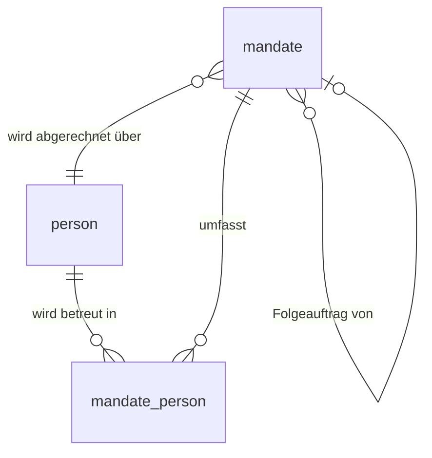

# Konzept: Person, Auftrag und Leistung trennen

Stand 29.08.2026. Diskussionsgrundlage, noch nicht entschieden.

Anlass ist die Accordix-Meldung: Die kantonale Erfassung verlangt eine Zeile pro Kind
und Leistung, die Abrechnung läuft aber pro Auftrag. Beide Sichten passen nicht mehr in
die eine Tabelle, in der sie heute stecken.

---

## 1. Was `clients` heute ist

Der Name führt in die Irre. `clients` ist keine Personentabelle, sondern eine
Auftragstabelle, in die die Personendaten hineinkopiert sind. Belegen lässt sich das an
den bestehenden Daten: Dana Levic steht als C1053 und C1054 in der Stammdatei, Lenny
Perren als C1035 und C1059, Maria Domenica Zwinggi Challco als C1019 und C1070, Awa
Burri als C1050 und C1077. Jeweils dasselbe Kind, dieselbe AHV-Nummer, zwei Zeilen,
weil zwei Leistungen laufen.

Fachlich stehen drei Dinge in dieser einen Zeile:

- **wer** betreut wird — Name, AHV-Nummer, Geburtsdatum, Geschlecht, Wohnort
- **was bewilligt wurde** — Leistungsart, Leistungsbesteller, Kostenträger, Kontingent, Bewilligungszeitraum
- **die Verbindung von beidem** — Eintritt und Austritt dieses Kindes in diese Leistung

Solange ein Kind genau einen Auftrag hat und ein Auftrag genau ein Kind betrifft, fällt
das nicht auf. Beides trifft nicht mehr zu.

---

## 2. Die beiden Fälle

### Fall A — ein Auftrag, mehrere Kinder

Werden in einer Familie mehrere Kinder betreut, läuft der Auftrag der Behörde über das
jüngste Kind. Auch die Abrechnung geht über dieses Kind. Accordix verlangt trotzdem eine
eigene Meldezeile je Kind, mit dessen eigenem Geburtsdatum, Geschlecht und AHV-Nummer.
Aus Anna, 4, und ihrem Bruder Paul, 9, werden im Reporting zwei Fälle, obwohl es
vertraglich einer ist.

Heute hat dieser Fall in der Stammdatei keine Darstellung. Entweder fehlt Paul ganz —
dann ist die Accordix-Meldung unvollständig — oder Paul bekommt eine eigene Zeile, und
dann sieht sie aus wie ein zweiter Auftrag mit eigenem Kontingent.

Ein Verdachtsfall in den aktuellen Daten: C1002 Luan Nipote läuft seit 01.10.2023 in
SPF, C1068 Yarrah Orion Nipote ist am 08.05.2026 geboren und startet SPF am selben Tag,
gleiche Gemeinde Meiringen. Das passt auf das Muster «Auftrag wandert auf das
Neugeborene», ist aber aus den Daten allein nicht entscheidbar.

### Fall B — ein Kind, mehrere Aufträge

Kommt schon heute vor und ist gelöst, indem die Zeile inklusive aller Personendaten
dupliziert wird. Die Aufträge können sich in mehr unterscheiden als nur der
Leistungsart. Awa Burri zeigt die Bandbreite:

| Feld | C1050 | C1077 |
|---|---|---|
| Leistungsart | ST01 SPF | ST07 Abklärung im Kinderschutz |
| Leistungsbesteller | SR015 SD Schönbühl | SR025 KESB Mittelland Nord |
| Kostenträger | P1000 Kant. Jugendamt | P1005 KESB Mittelland Nord |
| Zeitraum | 01.02.2026–31.01.2027 | 01.06.2026–31.08.2026 |
| Kontingent Fahrt/direkt/indirekt | 4 / 16 / 8 | 100 / 100 / 50 |
| Zuweisung | Einvernehmlich über Sozialdienst | *leer* |
| Geburtsdatum | 29.10.2018 | 43402 |

Die letzte Zeile ist der Punkt. Dasselbe Geburtsdatum, zwei Schreibweisen, weil eine der
beiden Zellen ihr Datumsformat verloren hat. Personendaten, die an zwei Stellen von Hand
gepflegt werden, laufen auseinander — und niemand merkt es, weil die Datenbank nicht
weiss, dass es dieselbe Person ist. Dieselbe Klasse von Fehler steckt hinter der
AHV-Kollision zwischen C1079 Stauffer, Caroline und C1083 Stauffer, Marlon Til.

---

## 3. Was daraus konkret schiefgeht

**Accordix meldet zu wenig.** Fehlt einem Geschwisterkind die Zeile, fehlt es in der
Meldung. Die Datei vom 29.08.2026 hat 78 Zeilen; ob darunter Aufträge mit weiteren
Kindern sind, lässt sich aus der Stammdatei nicht beantworten.

**Die Abrechnung kann zu viel melden.** Bekommt ein Geschwisterkind eine eigene Zeile
und werden dort Stunden gebucht, entstehen zwei Rechnungen, wo die Behörde einen Auftrag
bezahlt. Auch die Kontingentprüfung zählt dann doppelt.

**Personendaten driften.** Siehe Burri.

**Die Accordix-Pflege fällt mehrfach an.** Zwölf Accordix-Felder je Kind, bei zwei
Leistungen zweimal einzutragen und bei jeder Änderung zweimal nachzuziehen.

---

## 4. Zielmodell

Drei Begriffe statt einem. Die Bezeichner bleiben englisch wie im übrigen Code, die
Fachbegriffe deutsch.

**`person` — das Kind.** Identität und Merkmale, die unabhängig vom Auftrag gelten:
AHV-Nummer, Vor- und Nachname, Geburtsdatum, Geschlecht, UMA/UMF, Hauptsprache,
Wohnkanton, Wohnort der Sorgeberechtigten. Jedes Kind genau einmal.

**`mandate` — der Auftrag.** Was die Behörde bewilligt hat: Leistungsart,
Leistungsbesteller, Kostenträger, Standort, Zuweisungsgrundlage, Bewilligungszeitraum,
Kontingente, Geschäftsnummer. Dazu `billing_person_id` — das Kind, über das abgerechnet
wird, also das jüngste. Und `predecessor_mandate_id` für Folgeaufträge, dazu unten mehr.

**`mandate_person` — die Leistung je Kind.** Die Verknüpfung, und zugleich genau das,
was Accordix als Zeile will: Eintritts- und Austrittsdatum *dieses Kindes*, war der
Austritt geplant, Austrittsgrund, Situation nach Austritt, die beiden leistungsartspezifischen
Felder für IBF und SPT, Bemerkungen.

Damit lösen sich beide Fälle ohne Sonderregel. Fall A ist ein `mandate` mit zwei
`mandate_person`-Zeilen, Fall B sind zwei `mandate` mit je einer `mandate_person`-Zeile
auf dieselbe `person`.

### Nebeneffekt: Bewilligungsende und Austritt trennen sich sauber

`accordix_mapping.md` warnt seit jeher, dass `end_date` das Bewilligungsende ist und
nicht den Austritt bedeutet. Im Zielmodell sind das zwei verschiedene Felder in zwei
verschiedenen Tabellen: `mandate.end_date` ist die Bewilligung, `mandate_person.end_date`
der Austritt des Kindes. Die Regel, die ich für die Meldung vom 29.08.2026 von Hand
setzen musste — Spalte S nur füllen, wenn Austrittsangaben erfasst sind — wird dadurch
überflüssig.

### Nebeneffekt: die offene Frage zum Eintrittsdatum wird beantwortbar

Ob Accordix in Spalte Q den Eintritt in die Leistung insgesamt oder den laufenden
Bewilligungszeitraum erwartet, ist mit Wegpiraten seit dem 25.08.2026 offen. Heute lässt
sich die Frage gar nicht beantworten, weil `start_date` bei jedem Folgeauftrag
überschrieben wird und das Erstauftragsdatum verloren geht. Mit
`mandate.predecessor_mandate_id` steht die Kette da, und beide Antworten sind ohne
Datenverlust bedienbar: laufender Auftrag heisst `mandate.start_date`, Erstauftrag heisst
das früheste `start_date` der Kette für dieses Kind.

Die Spalte kostet fast nichts und sollte mitgenommen werden, auch solange die Frage
offen ist. Rückwirkend füllen lässt sie sich für Altfälle allerdings nicht.

---

## 5. Umsetzung in zwei Stufen

### Stufe 1 — drei Spalten in `clients`

Die kleine Variante nutzt aus, dass `clients` heute bereits die Verknüpfungstabelle
*ist*. Ihr fehlen nur die beiden Fremdschlüssel und ein Kennzeichen:

| Spalte | Zweck |
|---|---|
| `person_id` | gleich auf allen Zeilen desselben Kindes |
| `mandate_id` | gleich auf allen Zeilen desselben Auftrags |
| `is_billing_case` | wahr auf genau einer Zeile je `mandate_id` |

Eine Zeile bleibt, was sie ist: ein Kind in einer Leistung, identifiziert über
`client_id`. Paul bekommt eine eigene Zeile mit Annas `mandate_id`, eigener `person_id`
und `is_billing_case = Nein`. Kontingente stehen nur auf der Abrechnungszeile.

**Warum das wenig kostet.** Rechnung und Zeiterfassung greifen nicht direkt auf `clients`
zu. Die Rechnung entsteht aus `service_data JOIN clients`
([invoice_processor.py:176](../src/invoices/modules/invoice_processor.py#L176)), die
Timesheets aus `relation_client_emp JOIN clients`
([client_data.py:41](../src/time_sheets/modules/client_data.py#L41)). Eine Zeile ohne
Mitarbeiterzuordnung erzeugt kein Timesheet, ohne Timesheet keine `service_data`-Zeilen,
ohne die keine Rechnungsposition. Der einzige Report, der `clients` direkt liest, ist der
Accordix-Report — und der wird ohne Codeänderung richtig, sobald das Geschwisterkind eine
Zeile hat.

`is_billing_case` ist damit Leitplanke, nicht Mechanismus. Zwei Prüfungen in
`python -m cli validate` machen sie wirksam:

- eine Mitarbeiterzuordnung in `relation_client_emp` auf einer Zeile mit
  `is_billing_case = Nein` ist ein Fehler
- genau eine Zeile je `mandate_id` muss `is_billing_case = Ja` tragen

**Warum eine eigene `mandate_id` und keine Selbstreferenz auf die `client_id` des
Auftragskinds.** Weil das jüngste Kind wechselt. Kommt ein Geschwister dazu, wandert der
Auftrag auf das Neugeborene; mit eigener Auftragsnummer verschiebt sich nur das
Kennzeichen, mit einer Selbstreferenz muss jede Zeile der Gruppe umgebogen werden und der
Verlauf ist weg. Dasselbe Muster wie beim `start_date`: die Datenbank hält den
Ist-Zustand und verliert die Historie.

**Migration der Bestandsdaten.** `person_id` über die AHV-Nummer vergeben, wo vorhanden,
sonst über Name und Geburtsdatum — betrifft vier bekannte Gruppen (Levic, Perren, Zwinggi
Challco, Burri). Die AHV-Kollision Stauffer muss vorher geklärt sein, sonst werden zwei
Kinder zu einer Person. `mandate_id` zunächst eins zu eins aus der bestehenden
`client_id` ableiten; wo mehrere Kinder auf einem Auftrag laufen, lässt sich das nur mit
Wegpiraten zusammen feststellen. `is_billing_case` überall auf wahr, weil heute jede Zeile
abgerechnet wird. Kein Bestandsdatensatz ändert dabei seine Bedeutung.

### Stufe 2 — echte Tabellen

`person` und `mandate` als eigene Tabellen, `clients` wird zur reinen
Verknüpfungstabelle oder zu einer Sicht darauf. Erst dann verschwindet die Duplikation
der Personendaten wirklich, und erst dann ist der Burri-Fall strukturell ausgeschlossen
statt nur sichtbar.

Der Aufwand liegt nicht im Datenmodell, sondern an den Rändern: `client_id` steht im
Kopf jedes Erfassungsbogens (Zelle F8), in jedem archivierten Timesheet und in
`service_data`. Deshalb sollte `client_id` als Schlüssel stabil bleiben, egal wie die
Tabellen dahinter geschnitten werden. Stufe 2 lohnt sich, wenn die doppelte Pflege der
Accordix-Felder oder ein weiterer Drift-Fall den Aufwand rechtfertigt — nicht vorher.

---

## 6. Auswirkungen auf die bestehenden Abläufe

| Ablauf | Stufe 1 | Stufe 2 |
|---|---|---|
| Accordix-Meldung | keine Änderung, wird von selbst vollständig | Join über drei Tabellen |
| Rechnungslauf | keine Änderung | Bezug auf `mandate` statt `clients` |
| Timesheet-Erzeugung | keine Änderung, neue Prüfung in `validate` | Zuordnung an `mandate` |
| Stammdaten-Import | drei Felder in `entities.client` ergänzen | neue Entitäten |
| Excel-Stammdatei | drei Spalten, Dropdown auf bestehende IDs | Blätter für Personen und Aufträge |
| Kontrollsummen im Excel | nur auf der Abrechnungszeile rechnen | unverändert je Auftrag |

---

## 7. Zu klären mit Wegpiraten

1. Welche der aktuell 78 gemeldeten Leistungen gehören zu einem gemeinsamen Auftrag mit
   weiteren Kindern? Ohne diese Liste bleibt die Accordix-Meldung unvollständig. Nipote
   (C1002 / C1068) wäre der erste Kandidat zum Nachfragen.
2. Wird das Kontingent pro Auftrag oder pro Kind bewilligt? Bei zwei Geschwistern: 16
   Stunden für die Familie oder 16 Stunden je Kind? Davon hängt ab, ob das Kontingent an
   `mandate` oder an `mandate_person` gehört.
3. Kommt ein jüngeres Geschwister dazu — entsteht ein neuer Auftrag, oder behält der
   bestehende seine Nummer und wechselt nur das Auftragskind?
4. Können Eintritt und Austritt innerhalb eines Auftrags je Kind abweichen? Vermutlich
   ja, etwa wenn das ältere Kind volljährig wird und die Betreuung der jüngeren
   weiterläuft. Falls nein, wird `mandate_person` deutlich schlanker.
5. Kann die Zuweisungsgrundlage bei Geschwistern je Kind unterschiedlich sein, oder gilt
   sie immer für den ganzen Auftrag?
6. Accordix-Eintrittsdatum: Erstauftrag oder laufender Auftrag? Weiterhin offen, siehe
   Abschnitt 4.
7. AHV-Kollision C1079 Stauffer, Caroline und C1083 Stauffer, Marlon Til auflösen, bevor
   `person_id` vergeben wird.

---

## 8. Was das Konzept nicht löst

Die Sorgeberechtigten bleiben unmodelliert. `sr_ap_first_name` und `sr_ap_last_name` sind
die Ansprechperson beim Leistungsbesteller, nicht die Eltern — David Dimitrijevic hängt
an elf Klienten, Nadine Marggi an neun. Geschwister lassen sich deshalb auch künftig
nicht automatisch erkennen; sie müssen bei der Auftragserfassung über `mandate_id`
zusammengeführt werden. Eine Haushalts- oder Familientabelle wäre der nächste Schritt,
wird aber von keiner der beiden Anforderungen erzwungen und bleibt deshalb draussen.

---

# Anhang A — Datenpflege in der Endstufe

Dieser Anhang ist für das Gespräch mit Wegpiraten gedacht und steht bewusst für sich:
keine Tabellennamen aus dem Code, keine Fremdschlüssel, kein Datenmodell-Vokabular. Er
beschreibt die Endstufe (Stufe 2), weil sich die Pflege dort am einfachsten erklären
lässt — in Stufe 1 steht dasselbe in einem einzigen Blatt und ist deshalb schwerer zu
zeigen.

## A.1 Drei Listen statt einer

| Liste | beantwortet | eine Zeile ist | ändert sich |
|---|---|---|---|
| **Kinder** | Wer wird betreut? | ein Kind, ein einziges Mal | selten — Umzug, Namensänderung |
| **Aufträge** | Was hat die Behörde bewilligt? | ein Auftrag | bei Verlängerung, Kontingentänderung |
| **Betreuungen** | Welches Kind wird in welchem Auftrag betreut, und wie lange? | ein Kind in einem Auftrag | bei Eintritt und Austritt |

Die dritte Liste ist die, die erklärungsbedürftig wirkt. Sie ist es nicht: **jede Zeile
darin ist genau eine Zeile der Accordix-Meldung.** Wer wissen will, wie die
Betreuungsliste aussieht, schaut in die Meldedatei — dieselben Fälle, dieselbe Anzahl,
dieselben Ein- und Austrittsdaten.

Zum Namen: «Betreuungen» ist ein Vorschlag. Falls Wegpiraten intern «Fall» für genau
diese Einheit sagt — ein Kind in einer Leistung, so wie in «Anna und Paul sind zwei
Fälle» —, sollte die Liste «Fälle» heissen. Die Benennung folgt dem Sprachgebrauch im
Betrieb, nicht umgekehrt. Nur der Auftrag sollte dann nicht auch «Fall» genannt werden.

Die heutigen Klientennummern gehen nicht verloren: Aus jeder bestehenden Klientenzeile
wird bei der Umstellung ein Auftrag mit derselben Nummer. Alte Erfassungsbögen und
archivierte Zeiterfassungen bleiben damit zuordenbar.

## A.2 Wohin gehört eine Angabe?

Drei Fragen, in dieser Reihenfolge:

1. Gilt die Angabe für das Kind, unabhängig davon, welcher Auftrag läuft? → **Kinder**
2. Gilt sie für den Auftrag, unabhängig davon, welches Kind darin betreut wird? → **Aufträge**
3. Braucht man beides — dieses Kind *und* diesen Auftrag —, um sie zu bestimmen? → **Betreuungen**

Probe aufs Exempel: Das Geburtsdatum ändert sich nicht, wenn Awa Burri einen zweiten
Auftrag bekommt — Frage 1, also Kinderliste. Der Kostenträger gehört zum Auftrag und ist
bei Awas beiden Aufträgen verschieden — Frage 2. Ein Austrittsdatum lässt sich ohne beide
Angaben nicht bestimmen: Paul tritt aus, aber nur aus diesem einen Auftrag — Frage 3.

| Kinder | Aufträge | Betreuungen |
|---|---|---|
| AHV-Nummer | Leistungsart | Eintrittsdatum |
| Vorname, Nachname | Leistungsbesteller | Austrittsdatum |
| Geburtsdatum | Kostenträger | war der Austritt geplant |
| Geschlecht | Standort (Unterseen / Bern) | Austrittsgrund |
| UMA/UMF | Bewilligung von / bis | anderer Austrittsgrund |
| Hauptsprache | Kontingent Fahrzeit / direkt / indirekt \* | Situation nach Austritt |
| Wohnkanton | Abrechnungskind | andere Situation nach Austritt |
| Wohnort der Sorgeberechtigten | Geschäftsnummer der Behörde | IBF: konsiliarische Versorgung |
| | Vorgängerauftrag | SPT: Betreuungstage pro Woche |
| | interne Notizen | Bemerkungen für Accordix |

\* Ob das Kontingent zum Auftrag oder zum einzelnen Kind gehört, ist noch offen — siehe
Abschnitt 7, Punkt 2. Dasselbe gilt für die Zuweisungsgrundlage, die hier vorläufig beim
Auftrag steht.

## A.3 Wie man die Betreuungsliste erklärt

Der Widerstand kommt fast immer als «warum kann das nicht einfach beim Auftrag stehen».
Dagegen hilft kein Modellargument. Was hilft, ist die Lücke zu zeigen:

> Paul tritt Ende August aus, Anna wird weiterbetreut. Wo trägst du Pauls Austrittsdatum
> ein? Beim Auftrag steht dann, der Auftrag sei zu Ende — er läuft aber weiter. Beim Kind
> steht dann, Paul sei ausgetreten — aus welchem Auftrag, wenn er zwei hätte?

Die Lücke ist bereits da; die Betreuungsliste ist die Antwort darauf, nicht ihre Ursache.
Danach lässt sich die Meldedatei danebenlegen: dort steht Pauls Austritt in einer eigenen
Zeile, Annas Zeile bleibt offen. Genau diese zwei Zeilen sind die Betreuungsliste.

Zwei Dinge, die das Gespräch erleichtern: Das Wort «Relationentabelle» gehört nicht
hinein — die Liste heisst Betreuungsliste, und das ist keine Vereinfachung, sondern ihr
richtiger Name. Und niemand muss das Modell verstehen, um es zu pflegen. Die drei Fragen
aus A.2 und die Ereignisliste aus A.4 genügen.

## A.4 Was wann zu pflegen ist

| Ereignis | Kinder | Aufträge | Betreuungen |
|---|---|---|---|
| Erstes Kind einer Familie, erstmals betreut | neue Zeile | neue Zeile | neue Zeile |
| Kind war früher schon einmal betreut | — | neue Zeile | neue Zeile |
| Laufend betreutes Kind erhält zusätzlich eine zweite Leistungsart | — | neue Zeile | neue Zeile |
| Geschwisterkind kommt in einen laufenden Auftrag | neue Zeile, falls noch nicht erfasst | — | neue Zeile |
| Ein Kind tritt aus, der Auftrag läuft für die Geschwister weiter | — | — | Austrittsfelder auf dieser einen Zeile |
| Der ganze Auftrag endet | — | Bewilligung bis | Austrittsfelder auf allen Zeilen des Auftrags |
| Verlängerung / Folgeauftrag | — | neue Zeile mit Vorgängerauftrag | neue Zeile je weiterbetreutem Kind |
| Neugeborenes kommt dazu, Abrechnung wandert | neue Zeile | Abrechnungskind ändern | neue Zeile für das Neugeborene |
| Familie zieht um | Wohnort ändern | — | — |
| AHV-Nummer wird nachgereicht | eine Zelle | — | — |
| Kontingent wird angepasst | — | Kontingent ändern | — |
| Mitarbeitende wechseln | — | Zuordnung am Auftrag ändern | — |

Die beiden letzten Zeilen der Kinder-Spalte sind der Gewinn der Umstellung: Heute müsste
eine nachgereichte AHV-Nummer bei Awa Burri an zwei Stellen eingetragen werden, und wenn
nur eine gepflegt wird, merkt es niemand.

Mitarbeitende hängen in der Endstufe am Auftrag, nicht am Kind. Damit entfällt auch das
Kennzeichen `is_billing_case` aus Stufe 1 — ein Auftrag hat genau ein Abrechnungskind,
und mehr braucht es nicht.

## A.5 Beispiele

### Beispiel 1 — Geschwister, ein Auftrag

Familie mit SPF, bewilligt über die jüngere Anna (4), betreut wird auch Paul (9).

**Kinder**

| Kind-Nr | Nachname | Vorname | Geburtsdatum | AHV-Nummer | Wohnort |
|---|---|---|---|---|---|
| K-041 | Beispiel | Anna | 14.02.2022 | 756.… | Wilderswil |
| K-042 | Beispiel | Paul | 03.06.2017 | 756.… | Wilderswil |

**Aufträge**

| Auftrag-Nr | Leistungsart | Besteller | Kostenträger | von | bis | Kontingent | Abrechnungskind |
|---|---|---|---|---|---|---|---|
| A-118 | SPF | SD Region Jungfrau | Kant. Jugendamt | 01.03.2026 | 28.02.2027 | 6 / 16 / 8 | K-041 |

**Betreuungen**

| Auftrag-Nr | Kind-Nr | Eintritt | Austritt |
|---|---|---|---|
| A-118 | K-041 | 01.03.2026 | |
| A-118 | K-042 | 01.03.2026 | |

Ergebnis: eine Rechnung über Anna, zwei Zeilen in der Accordix-Meldung. Das Kontingent
steht einmal da und wird einmal geprüft.

### Beispiel 2 — ein Kind, zwei Aufträge

Awa Burri, echte Daten aus der aktuellen Stammdatei.

**Kinder** — eine einzige Zeile

| Kind-Nr | Nachname | Vorname | Geburtsdatum | AHV-Nummer | Wohnort |
|---|---|---|---|---|---|
| K-050 | Burri | Awa | 29.10.2018 | 756.2642.2680.24 | Urtenen-Schönbühl |

**Aufträge**

| Auftrag-Nr | Leistungsart | Besteller | Kostenträger | von | bis | Kontingent | Abrechnungskind |
|---|---|---|---|---|---|---|---|
| C1050 | SPF | SD Schönbühl | Kant. Jugendamt | 01.02.2026 | 31.01.2027 | 4 / 16 / 8 | K-050 |
| C1077 | Abklärung | KESB Mittelland Nord | KESB Mittelland Nord | 01.06.2026 | 31.08.2026 | 100 / 100 / 50 | K-050 |

**Betreuungen**

| Auftrag-Nr | Kind-Nr | Eintritt | Austritt |
|---|---|---|---|
| C1050 | K-050 | 01.02.2026 | |
| C1077 | K-050 | 01.06.2026 | |

Das Geburtsdatum steht genau einmal. Der heutige Zustand — auf der einen Zeile
`29.10.2018`, auf der anderen `43402` — kann nicht mehr entstehen.

### Beispiel 3 — ein Neugeborenes kommt dazu

Luan Nipote wird seit 01.10.2023 in SPF betreut. Am 08.05.2026 wird Yarrah Orion geboren
und in die Betreuung aufgenommen; der Auftrag läuft ab da über das jüngere Kind.

**Kinder** — eine Zeile ergänzen

| Kind-Nr | Nachname | Vorname | Geburtsdatum |
|---|---|---|---|
| K-002 | Nipote | Luan | 10.03.2017 |
| K-068 | Nipote | Yarrah Orion | 08.05.2026 |

**Aufträge** — nur das Abrechnungskind ändert sich

| Auftrag-Nr | Leistungsart | von | bis | Abrechnungskind |
|---|---|---|---|---|
| C1002 | SPF | 01.10.2023 | 31.03.2027 | ~~K-002~~ → K-068 |

**Betreuungen** — eine Zeile dazu, die bestehende bleibt unberührt

| Auftrag-Nr | Kind-Nr | Eintritt | Austritt |
|---|---|---|---|
| C1002 | K-002 | 01.10.2023 | |
| C1002 | K-068 | 08.05.2026 | |

Luans Eintrittsdatum bleibt der 01.10.2023. Heute würde der Wechsel des Auftragskinds
dieses Datum überschreiben — genau der Verlust, der bei den Folgeaufträgen bereits
auftritt.

Falls die Behörde in so einem Fall einen neuen Auftrag ausstellt statt den bestehenden
weiterzuführen, sieht es anders aus: neue Auftragszeile mit Vorgänger C1002, die alten
Betreuungen werden abgeschlossen, neue angelegt. Welche der beiden Varianten gilt, ist
Punkt 3 der offenen Fragen.

### Beispiel 4 — ein Geschwisterkind tritt aus

Für Paul aus Beispiel 1 endet die Betreuung per 31.08.2026 planmässig, Anna wird
weiterbetreut.

**Betreuungen** — nur eine Zeile wird angefasst

| Auftrag-Nr | Kind-Nr | Eintritt | Austritt | geplant | Situation nach Austritt |
|---|---|---|---|---|---|
| A-118 | K-041 | 01.03.2026 | | | |
| A-118 | K-042 | 01.03.2026 | 31.08.2026 | Ja | keine weitere Leistung |

Auftrag, Kontingent und Annas Betreuung bleiben unverändert. In der Accordix-Meldung
bekommt Paul seine Austrittsangaben, Annas Zeile bleibt offen. In der heutigen Struktur
ist das nicht darstellbar — es gibt nur eine Zeile, und die kann nicht gleichzeitig
beendet und laufend sein.

## A.6 Typische Fehler bei der Pflege

`python -m cli validate` prüft heute nur die Konfiguration. Die folgenden Prüfungen auf
den Daten wären mit der Umstellung zu ergänzen; die letzte Spalte sagt, welche Fehler
sich damit überhaupt maschinell finden lassen.

| Fehler | Folge | maschinell prüfbar |
|---|---|---|
| Kind ein zweites Mal in der Kinderliste angelegt statt eine zweite Betreuung | Personendaten laufen auseinander, Accordix meldet zwei Kinder | ja, über doppelte AHV-Nummern |
| Betreuung mit einer Auftrags- oder Kindnummer, die es nicht gibt | Zeile fehlt in der Meldung | ja |
| Auftrag ohne Abrechnungskind | keine Rechnung | ja |
| Abrechnungskind, das im eigenen Auftrag keine Betreuung hat | Rechnung ohne gemeldete Leistung | ja |
| Austritt beim Auftrag statt bei der Betreuung eingetragen | Auftrag gilt als beendet, obwohl Geschwister weiterlaufen | teilweise — Auftragsende ohne Austritte je Kind ist auffällig |
| Geschwisterkind ohne Betreuungszeile | Kind fehlt in der Accordix-Meldung | nein, das sieht nur Wegpiraten |

Der letzte Punkt ist der einzige, den keine Prüfung findet: Ein Kind, das gar nicht
erfasst ist, fehlt lautlos. Deshalb gehört bei jeder Auftragserfassung die Frage dazu, ob
im selben Haushalt weitere Kinder betreut werden.

Der vorletzte ist der häufigste, weil er sich richtig anfühlt. Die Merkregel dagegen:
**«Bewilligung bis» steht auf dem Papier der Behörde, «Austritt» ist das, was tatsächlich
passiert ist.** Die beiden fallen oft auseinander — in der Meldung vom 29.08.2026 haben
60 der 78 Fälle keinen Austritt, und bei 59 davon liegt das Bewilligungsende in der
Zukunft.
